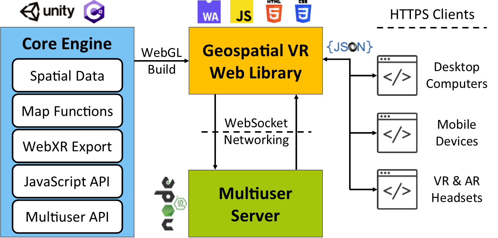
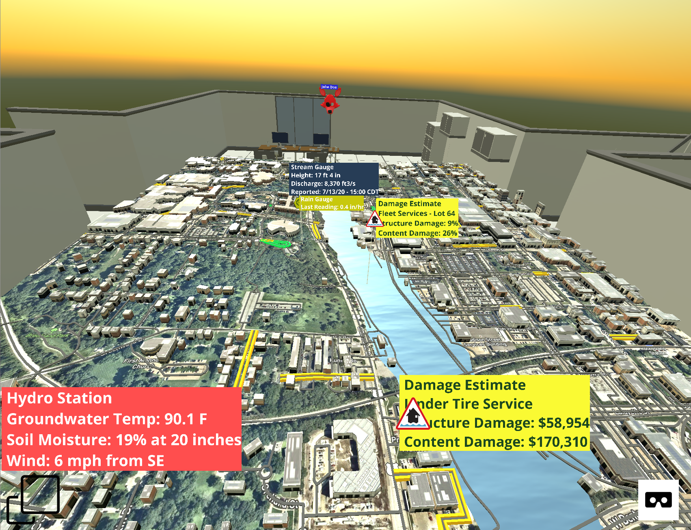
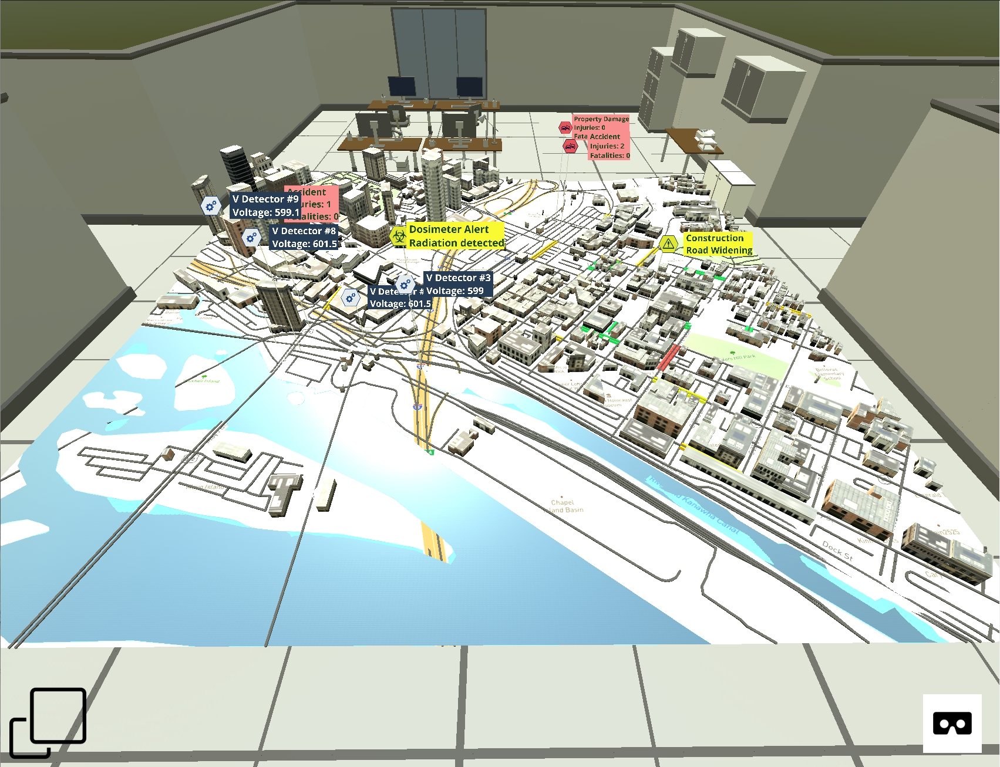
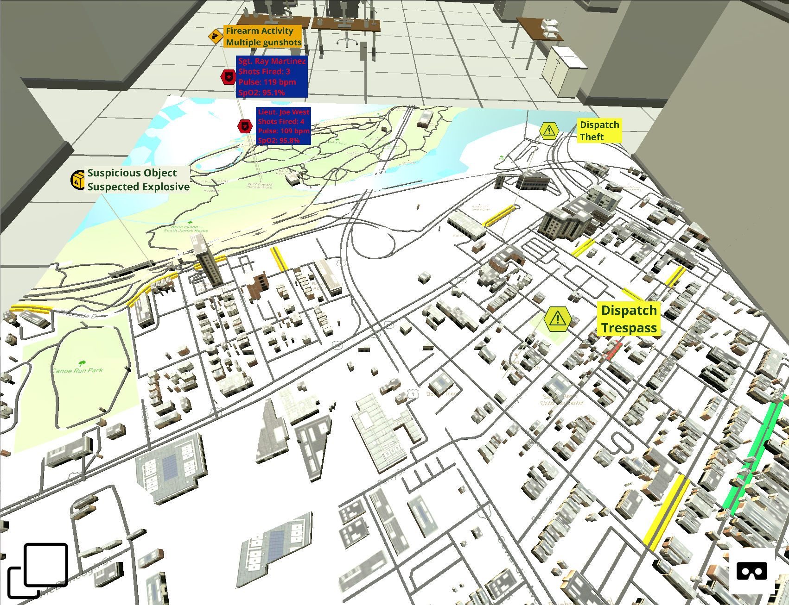

<p align="center"></p>

<h3 align="center">
  A Web-based Virtual Reality Framework for Collaborative Environmental Simulations
</h3>

<br>

## Table of Contents

- [Introduction](#introduction)
- [How To Use](#how-to-use)
- [Use Cases](#use-cases)
  - [Flood](#flood)
  - [Wildfire](#wildfire)
  - [Transportation](#transportation)
  - [Active Shooter](#active_shooter)
- [Supported Browsers](#supported-browsers)
- [Feedback](#feedback)
- [License](#license)
- [Acknowledgements](#acknowledgements)

## Introduction

This project introduces GeospatialVR, an open-source collaborative virtual reality framework to dynamically create 3D real-world environments that can be served on any web platform and accessed via desktop and mobile devices and virtual reality headsets. The framework can generate realistic simulations of desired locations entailing the terrain, elevation model, infrastructures, dynamic visualizations (e.g. water and fire simulation), and information layers (e.g. disaster damages and extent, sensor readings, occupancy, traffic, weather). These layers enable in-situ visualization of useful data to aid public, scientists, officials, and decision-makers in acquiring a bird’s eye view of the current, historical, or forecasted condition of a community. The framework incorporates multiuser support for remote virtual collaboration. GeospatialVR’s purpose is to augment cyberinfrastructures with geospatial components to constitute the next-generation of information systems and decision support systems powered by immersive technologies. Finally, case studies have been developed for flooding, wildfire, transportation, and active shooter response.



## How To Use

This repository provides a boilerplate to use GeospatialVR. Just download and run the "index.html".

To examine how the data is provided and visualizations are managed for the VR environment, check out [geospatialxr.js](script/geospatialxr.js)

As a brief summary of basic functionality:

- Load location on the map
```js
updateMapLocation(lat, lon, zoom); // default zoom is 16
```

Extend current map by loading more tiles
```js
extendMap(west, east, north, south); // for initial map, 1 tile is loaded per each direction
```

Enable traffic layer on active map
```js
enableTraffic();
```

Add points of interest with labels on the map
```js
var pois = {"pois": [
                {"lat": 37.527453997298124, 
                  "lon":  -77.45388267315083, 
                  "type": "Police", 
                  "height": 66,
                  "content": "Sgt. Ray Martinez \nShots Fired: 3\nPulse: 119 bpm\nSpO2: 95.1%"},
                {"lat": 37.527490508593274, 
                  "lon":  -77.4538472520168, 
                  "type": "Police", 
                  "height": 45,
                  "content": "Lieut. Joe West \nShots Fired: 4\nPulse: 109 bpm\nSpO2: 95.8%"},
      ]};
addPOI(pois);

// Type parameter refers to the label styling. Currently available label types:
// Warning, Accident, Radioactive, SensorGeneric, StreamSensor, RainGauge, Soil, Shooting, Police, Unknownpackage, Damage, Fireman

```

## Use Cases

### Flood

A case study for flood management use case for Iowa City, IA, showing a flood animation and relevant data layers (i.e. stream gauges, rain gauges, hydro stations for groundwater and soil moisture data, estimated flood damages for current or forecasted flood scenarios, and traffic congestion).

Flooding Use Case
:-------------------------:


### Wildfire

A case study for wildfire use case for Tucson, AZ, showing a fire animation and relevant data layers (i.e. characteristics and center of the wildfire, stranded groups of people detected by drones or emergency calls, air quality and gas measurements in the area, first responder vitals, and traffic congestion).

Wildfire Use Case
:-------------------------:


### Transportation

A case study for transportation use case for Richmond, VA, showing relevant data layers (i.e. voltage detectors, radiation spills, constructions, accident reports, and traffic congestion).

Transportation Use Case
:-------------------------:


### Active Shooter

A case study for law enforcement, showing relevant data layers (i.e. detected gunshots, responding officers and their vitals, objects of interest, calls for dispatch, and traffic congestion).

Active Shooter Use Case
:-------------------------:



## Supported Browsers

The presented web component is supported by default in;

- Google Chrome
- Mozilla Firefox
- Opera
- Safari
- Microsoft Edge

The speech recognition is only supported in Google Chrome, Opera, and Microsoft Edge.

Sources: [Mozilla](https://developer.mozilla.org/en-US/docs/Web/Web_Components), [W3Counter](https://www.w3counter.com/globalstats.php), [Can I Use Speech Recognition](https://caniuse.com/#search=speech)

## Feedback

Feel free to send us feedback by filing an issue.

## License

This project is licensed under the MIT License - see the [LICENSE](LICENSE) file for details.

## Acknowledgements

This project is developed by the University of Iowa Hydroinformatics Lab (UIHI Lab): [https://hydroinformatics.uiowa.edu/](https://hydroinformatics.uiowa.edu/).
